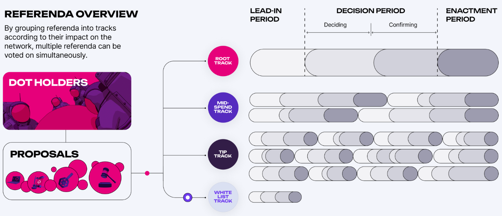

# Polkadot OpenGov Overview

**Polkadot OpenGov launched** on Polkadot on June 15th 2023 - It represents the **next phase of Polkadot governance, bringing the next generation of** fully decentralized, unstoppable, and open governance to Web3.

It’s much more efficient than the previous governance system, and all central decision-making bodies were removed. Now, full control of **Polkadot and its treasury has been handed over to the community**, and their decisions are automatically carried out, on-chain.

Polkadot OpenGov plays a **major role** in: Decentralization, unstoppability, on-chain intelligence, and future-proofness (through upgradability).

<iframe width="560" height="315" src="https://www.youtube.com/embed/Iv7b4ZxUzoM?si=I9TTfSydSJiErcx4" title="YouTube video player" frameborder="0" allow="accelerometer; autoplay; clipboard-write; encrypted-media; gyroscope; picture-in-picture; web-share" allowfullscreen></iframe>

Here are some great links for learning more as well as screenshots to explain visually how the process works.

[Polkadot OpenGov | The Pinnacle of Blockchain Governance | Polkadot](https://polkadot.network/features/opengov/)

[Polkadot’s “How-to” AMA session dedicated to Polkadot OpenGov](https://www.crowdcast.io/e/polkadot-how-tos/register)

[Polkadot OpenGov · Polkadot Wiki](https://wiki.polkadot.network/docs/learn-polkadot-opengov)

The wiki has a very detailed guide on Polkadot OpenGov

## Referendum

### Lifecycle

A referendum must go through three stages for it to be enacted.

### Overview

There are many different tracks, each with their own support and approval curves. Some of them also have different lead in, decision and enactment periods as seen below.

### Threshold curves

For a proposal to move from the decision period to the enactment period, the voting turn out (support) needs to be met.

Different tracks have different curves as pictured above.

Here is a short video explaining how the curves work.

<iframe width="560" height="315" src="https://www.youtube.com/embed/wk58C-2CqPI?si=1DXdgiOzqqIEthfF" title="YouTube video player" frameborder="0" allow="accelerometer; autoplay; clipboard-write; encrypted-media; gyroscope; picture-in-picture; web-share" allowfullscreen></iframe>
