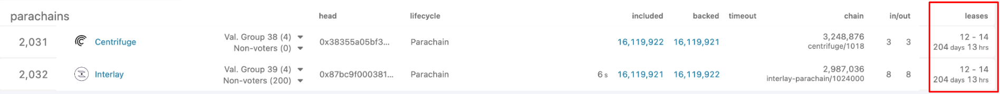
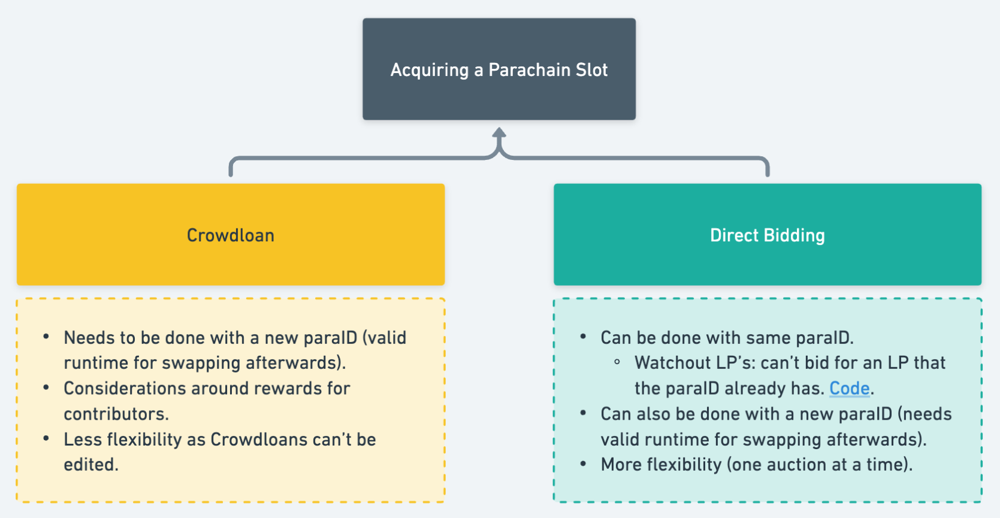

# Parachain leases & acquiring a lease

    🗣️ 📝The maximum parachain slot time on Polkadot is 24 months

**"Lease Period"** is a 3 month time allocation.

You will see lease periods represented for parachains like the following.

LP13-20 (8 periods)8 (lease periods) \* 3 (months per period) = 24 month lease

It’s possible to bid for less time, e.g. 1 period, or 4 periods only, but the majority of teams go for a 2 year slot.

    ⚠️ It’s important to ensure your parachain lease periods are set correctly when you bid!

Leases “12-14” means that the team has a slot until the end of LP14.

The team needs to get a new lease that includes LP15

- Could be a slot leased for `LP15-XX` (max LP15-22).
- Could be a slot leased for `LPYY-...-LP15-...-LPYY)`.

## Competing against other bids

**“Total Value Locked”** is compared against the different bids for one particular slot.

The formula used is `Total Value Locked = Number of Leases * Bid`

If different bidders for same auction with different number of leases, this needs to be considered.

_Example_

Auction: for `LPs 14-21`.

Team A has an existing slot, with LP 14 as a last LP.

Team B has no existing slot.

|        | LPs       | Bid     | Total Value Locked |
| ------ | --------- | ------- | ------------------ |
| Team A | 15-21 (7) | 110 DOT | 770                |
| Team B | 14-21 (8) | 100 DOT | 800                |
