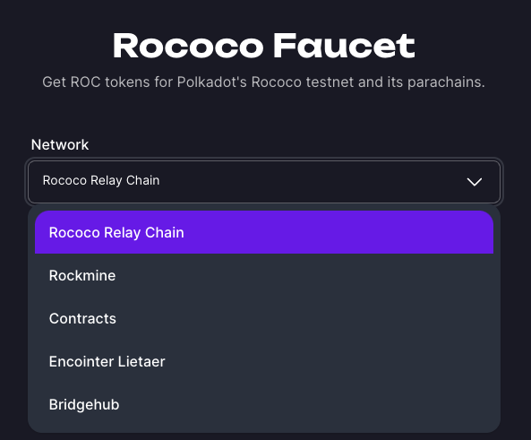
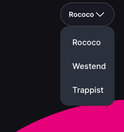

# Polkadot Faucet

If you’re developing on Polkadot you’ll very likely use Westend or Rococo, luckily there exists an easy to use Faucet to get tokens - without having to jump through complex hoops.

With the faucet you’ll be able to get ROC or WND tokens sent to several different parachains that exist in these test networks.

You’ll need a Polkadot wallet (Talisman, Nova, Subwallet) to obtain a Rococo or Westend wallet and wallet address.

👉🏻 [https://paritytech.github.io/polkadot-testnet-faucet/](https://paritytech.github.io/polkadot-testnet-faucet/)

    

To change between networks, use the selector in the top right:

    

