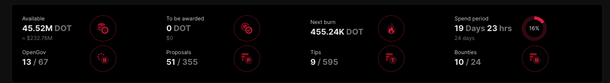

# The Polkadot Treasury

The [Polkadot treasury](https://wiki.polkadot.network/docs/learn-polkadot-opengov-treasury) is a huge pot of funds, denominated in DOT, that is used to further Polkadot’s development, reward key contributors, fund ecosystem events, etc.

Presently, the treasury is mainly funded via part of DOT’s inflation (inflation is split between stakers and the treasury, depending on what percentage of the total DOT supply is staked). Additional revenue sources include slashing misbehaving stakers, and transaction fees. In the future, the treasury may also be funded by coretime sales.

Spend periods last for twenty four days, after which 1% of the treasury’s balance is burned.

If you are interested in trying to get funding from the treasury, there are a few options available, depending on the size of your request.

[https://www.dotreasury.com/dot/bounties](https://www.dotreasury.com/dot/bounties) is a great website for many stats regarding the treasury across Polkadot and Kusama.

## Treasury Proposals

The Polkadot treasury consists of multiple tracks, each with different funding abilities and requirements for successful proposals. There are two main terms to familiarize yourself with: **Support** and **Approval**.

**Support** is the percentage of the total DOT supply that has voted (both AYE and NAY) on your proposal. For example, if the total supply is 10 DOT, and your proposal receives 5 DOT worth of votes, it will have 50% support.

**Approval** is the distribution of AYEs and NAYs on your proposal. For example, if your proposal has received 3 DOT worth of AYEs, and 2 DOT worth of NAYs, it will have 60% approval.

Note that vote conviction (locking your tokens for longer to increase their voting power) _does not_ impact **support**, but _does_ impact **approval**. Looking at the above example, if we suppose that the AYE voters used only 1x conviction, and the NAY voters used 2x conviction, the resulting vote will be 3 AYE and 4 NAY, which is an approval of 42.8%. However, there would still only be 5 DOT worth of **support**.

**Submitting A Proposal**

All treasury proposals should first be submitted as discussions on a governance platform like [Polkassembly](https://polkassembly.io/) or [SubSquare](https://www.subsquare.io/), with ample time for community feedback (at least one week). You should solicit as much feedback as possible, as failing to do so may ultimately waste time if your proposal fails. Make sure to submit the discussion from an account with a [verified on-chain ID](https://support.polkadot.network/support/solutions/articles/65000181981-how-to-set-and-clear-an-identity).

See the Polkadot wiki for technical [instructions](https://wiki.polkadot.network/docs/learn-polkadot-opengov-treasury#submit-treasury-proposal-preimage) on submitting an on-chain proposal.

**Small Spender**

TBA

**Medium Spender**

TBA

**Big Spender**

TBA

**Treasurer**

TBA

**Small Tipper**

TBA

**Big Tipper**

TBA
